# Introduction

3D simulation and visualization have been recognized as powerful tools capable of enhancing data acquisition and manipulation (3D-Labs) or providing efficient and versatile representations of 3D scientific data, including point clouds and voxels. These techniques are used in various fields such as medicine, engineering, and environmental science. This project aims at strengthening our expertise in that technological field and embedding us more in the Dutch ecosystem. 

In the field of digital art history, there is a particular interest in realistically reconstructing physical objects and scenes. For example, the digital art history group at Utrecht University [@frequin] has been working on digital reconstruction of historical monuments [@uu:2024]. For this effort, certain materials are particularly hard to recreate realistically, such as gold leaf and other culturally relevant reflective materials. 

Recent advances in novel view synthesis and SLAM [@tosi:2025] have opened the door to photo-realistically reconstructing both indoor and outdoor scenes. A paper published in 2001 describes a method to represent a scene as a Neural Radiance Field [@mildenhall:2020], or NeRF, which describes the light properties of the scene implicitly. This model can convert a view-position and -direction into a color image. The NeRF can be trained on a collection of images of the same object or scene. 

Images generated by a NeRF can approach photo-realism. However, training such a model takes a prohibitively long time, and new views cannot be generated at high frame rates. Both challenges could be overcome by a paradigm shift to representing the scene as colored Gaussian splats: anisotropic Gaussian distributions centered on 3D points. This method of 3D Gaussian Splatting [@kerbl:2023] could train a model in less than an hour and be inspected at real-time frame rates. 

In this project, we explore 3D Gaussian Splatting as a means to reconstruct objects with reflective materials for digital heritage. This application requires photorealistic representations of objects with view-dependent coloring, both of which are features of 3D Gaussian Splatting. 

# 3D Gaussian Splatting

This reconstruction system has three principal components. Firstly, it defines a novel representation for photorealistic novel view synthesis, in the form of anisotropic 3D Gaussian splats colored using spherical harmonics. Secondly, it provides CUDA shaders that can render this representation in real-time. Finally, it provides a collection of scripts to train a Gaussian splats model on a particular set of input images. 

The 3D Gaussians are defined by a full 3D covariance matrix $\Sigma$ defined in world space centered at point (mean) $\mu$: 

$$G(x) = e^{-\frac{1}{2}(x)^T\Sigma^{-1}(x)}$$

This Gaussian is multiplied by opacity 𝛼 when rendering using the CUDA shaders. 

The CUDA shaders can project anisotropic Gaussians to generate frames. To do so, they implement an efficient ordering scheme that splits the frame into tiles and sorts Gaussians per tile. This greatly improves rendering and training times, because it culls Gaussians early and replaces per-pixel sorting. 

Training Gaussian splats takes several sequential steps. Firstly, the training scripts require photographs with camera parameters and a preliminary sparse point cloud of the scene. Both can be generated by running Structure from Motion (SfM) [@schoenberger:2016] on a set of images. If the raw input is in the form of a video, frames must be extracted to provide the input for SfM. Special care should be taken if the input was generated using multiple cameras. 

Secondly, training Gaussian splats can be supported by depth images. This is especially important when working with a poorly calibrated camera or in poorly textured regions. The reconstruction system provides a script to normalize these depth images across the dataset. 

Finally, Gaussians are trained using pytorch. This uses the CUDA shaders for both the forward pass (rendering) as well as for the backward pass (computing gradients). During this training process, additional Gaussians can be spawned in complex regions, and Gaussians can be pruned when their impact becomes too small. 

Each of these processing steps depends on the earlier generated output. They must be carefully customized to fit the processed scene. For example, uncalibrated cameras produce better outputs if some additional exposure settings are trained alongside the Gaussians. 

# Dependencies

The 3D Gaussian Splatting software has several dependencies, many of which must be of a certain older version to work properly. Most importantly, the shaders require CUDA, which limits the hardware to Nvidia graphics cards. The training process places a large strain on graphics memory, so 24GB VRAM is required. Some sources recommend a Nvidia A100 graphics card. We have successfully used the software on a Nvidia A10 with a single GPU. 

Looking at the issue tracker of the Gaussian Splatting repository [@gaussian-splatting:2023], it seems various users have managed to get the software running on a Linux system. We were unable to do so, at least on the SURF research cloud [@research-cloud] machines we had access to. The repository mentions an instruction video [@stephens:2023] on how to install and use their software on Windows. This proved invaluable in determining the combination of working dependency versions. We provide detailed instructions for installing the following dependencies in the readme file of our 3DGS_automation repository [@3dgs_automation:2025].

The base requirements are git, conda, and CUDA 11.8. The repository provides a conda environment file to install several others, including python 3.7.13, pip, cudatoolkit 11.6, plyfile, pytorch 1.12, and opencv. Compiling the CUDA shaders from source also requires Visual Studio 2019, which is no longer provided for download by Microsoft. Luckily, there is an external download link for the Visual Studio 2019 Community edition [@vs_community]. Together, these should enable compiling Gaussian Splatting from source. 

The initial steps in the reconstruction system depend on third-party software. Extracting frames from video requires FFMPEG [@ffmpeg], which needs 7-zip [@7zip] to be unpacked. Structure from Motion is done using COLMAP [@colmap]. Some actions require resizing images using ImageMagick [@imagemagick]. Generating the optional depth images can be done using Depth Anything v2 [@depth-anything] with their pre-trained weights [@da_weights]. 

The generated 3D Gaussian splats data can be viewed using the SIBR viewer [@sibr], which is included as a submodule with the Gaussian Splatting repository. This viewer requires openGL for rendering. Unfortunately, it seems that even with openGL libraries present on a cloud machine, it cannot be used to render through a remote client unless there is a monitor physically attached to the cloud machine. 

There is another Three.js-based viewer. This can either be built and run locally from source [@gaussiansplats3d], requiring Node.js [@nodejs]. Alternatively, the data can be viewed using its online viewer [@gaussiansplats3d_demo]. While this viewer can be used to inspect the data, it lacks the extensive functionality of the SIBR viewer. Missing features include rendering the third level of spherical harmonics colors, reducing the extent of the Gaussians, cropping the scene, and overlaying the camera pyramids of the input images. 

# 3DGS Automation

It may be clear from the above that installing and running 3D Gaussian Splatting requires particular care and attention. We have implemented a set of python and batch scripts to simplify the process. These are made publicly available in the 3DGS_automation repository [@3dgs_automation:2025], together with detailed instructions on installation and usage. 

At the core are three python scripts. These perform frame extraction from video and Structure from Motion, depth image generation, and Gaussian splat training. These must be implemented in separate scripts, because depth image generation requires a different conda environment, and switching between python versions must be done outside of a python script. 

The input, intermediate, and output data are managed in a central location. Processing steps are skipped if the data it generates is already present, unless that step is forced. A single config file stores the data paths and a few processing arguments. By default, a fixed directory structure is imposed on the data, but output of individual steps may be stored in other explicit locations. 

For ease of use on Windows systems, each step can also be performed using a one-line batch script call. Each of these three batch scripts activates the correct conda environment and calls the relevant python script. A fourth batch script runs the full pipeline. 

# Application to Objects with Reflective Materials

We have applied the 3D Gaussian Splatting pipeline to a few objects with reflective materials. Unfortunately, we do not have access to any art-historical objects with gold leaf surfaces. As an alternative, we have processed two datasets of a velour pillow and some reflective toy diamonds. 

Before processing our own data sets, we tested that the software worked on the benchmarks used in the Gaussian Splatting paper. Processing the garden dataset images produced output with very similar visual quality to the Gaussian Splatting video, as shown in \autoref{fig:garden}. 

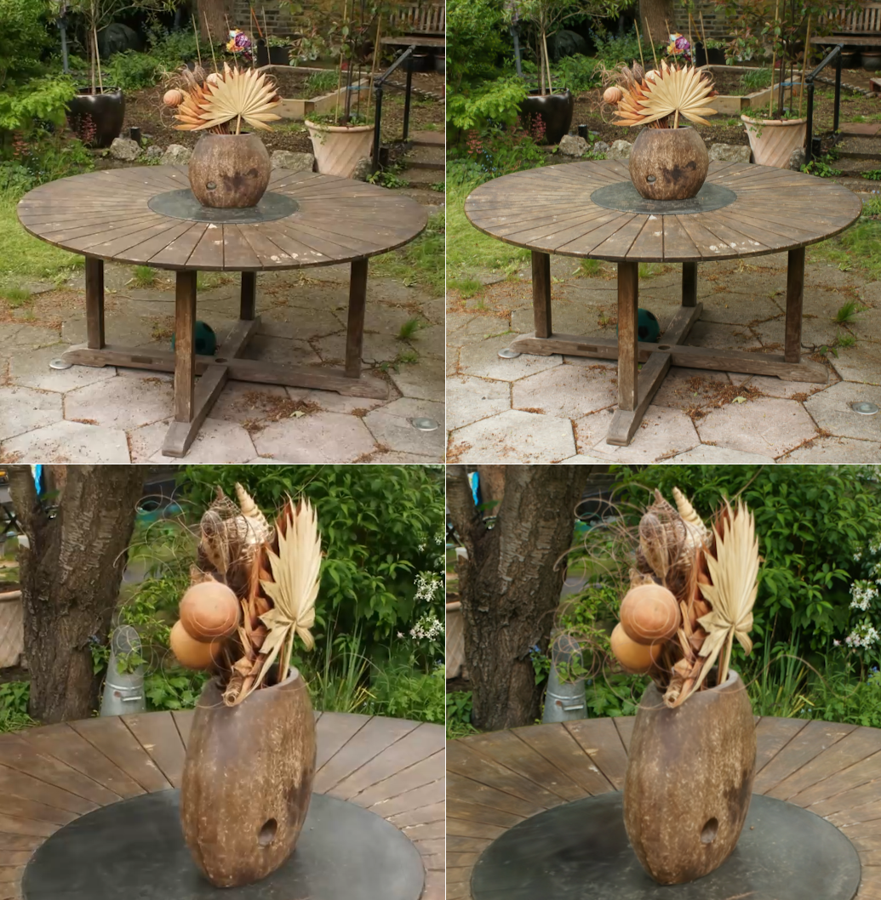{ width = 100% }

## Hornet 

After checking whether a benchmark could be processed, we did some preliminary tests on our own Hornet dataset to optimize processing parameters. We checked whether we could process a dataset of 170 frames, 340 frames, with optimized renderer (sparse Adam), with depth images, and with exposure compensation, as shown in \autoref{fig:hornet}. 

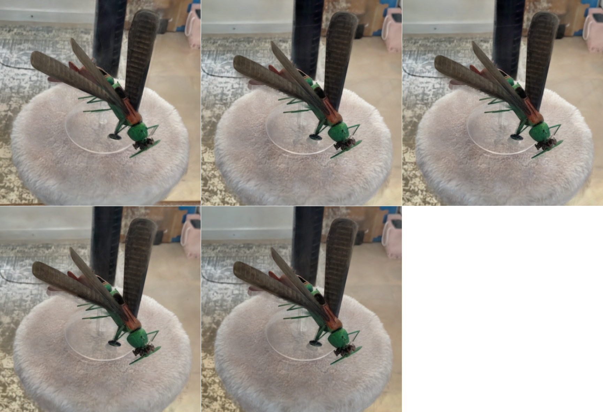{ width = 100% }

Note that this output is based on a short video with a mediocre camera and somewhat shaky movement. The output is blurry in places and has a lot of floaters. The output has similar visual quality between all mentioned tests. Enabling sparse Adam rendering greatly reduced processing time. 

For each of the following tests, we enabled sparse Adam rendering, add depth images, and enable exposure compensation. 

## Pillow 

The first proper dataset of an object with reflective material was a video of a velour pillow. The reflective nature of the material is shown in \autoref{fig:pillow}. The color and brightness are heavily influenced by local light sources and viewing angles. The same corner of the pillow is indicated by a red star in each image. 

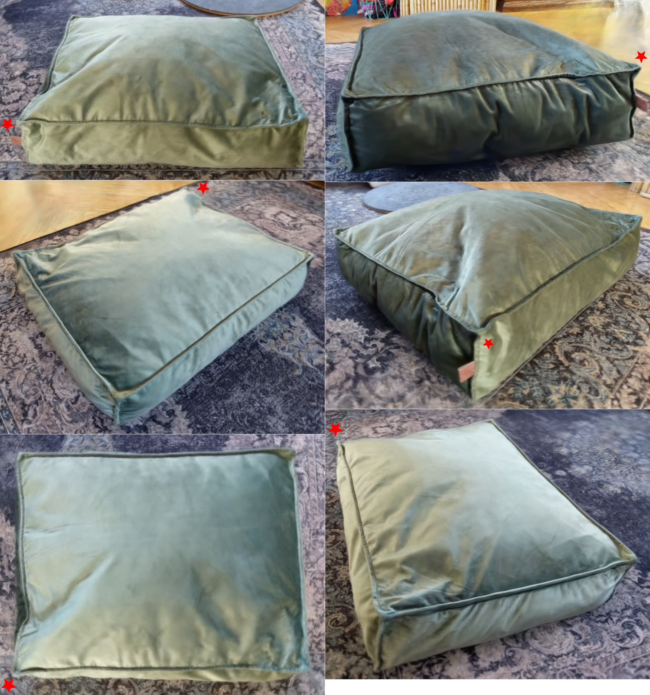{ width = 100% }

### Multiple Cameras 

We captured a second video of the same scene using a different camera. In \autoref{fig:pillow_camera}, we compare the output of only processing using the original camera to using both cameras. 

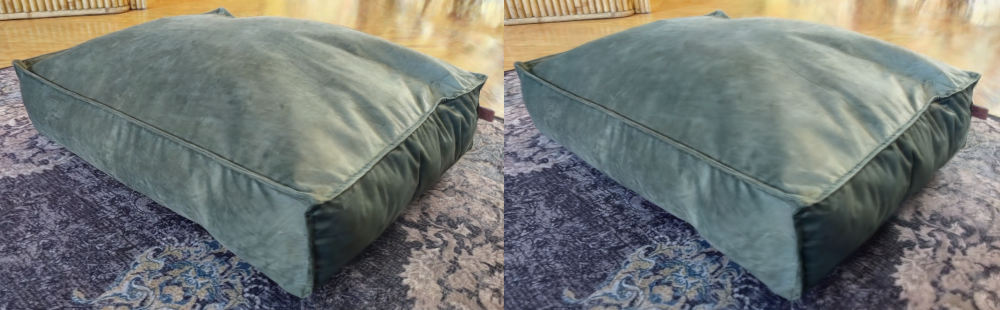{ width = 100% }

Notice that including the second camera results in the output being more blurred. This is likely because the second camera has a lower resolution than the original camera. 

Regardless, we provide a description in our readme file on how to make some minor adjustments to one Gaussian Splatting script to enable processing images from multiple cameras with different camera parameters. In this case, the frames extracted from each camera should be collected in a separate directory. 

## Diamonds 

The second proper dataset of an object with reflective material was a video of a pair of toy diamonds and a sparkly windmill toy. The translucent and reflective nature of the material is shown in \autoref{fig:diamonds}. The toy diamonds are lighter near their thinner bottom and show some specular reflections at certain viewing angles. 

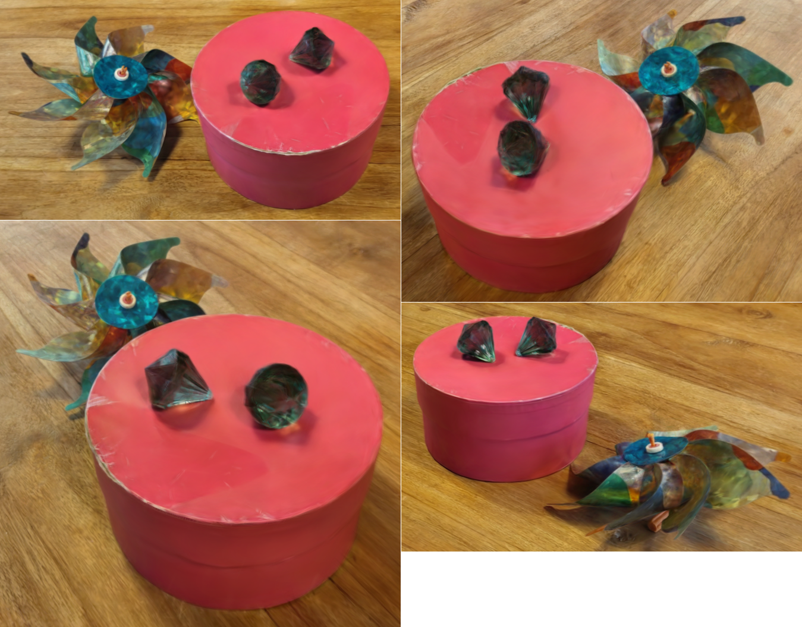{ width = 100% }

However, when directly comparing an input image of extreme specular reflection to the same viewpoint of the 3D Gaussians, it becomes apparent that the bright facet is not reconstructed correctly, as shown in \autoref{fig:diamonds_reflection}. 

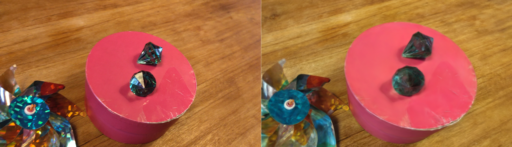{ width = 100% }

### Increasing Framerate 

The specular surfaces may not have been reconstructed correctly, because they were not sampled enough. We increased the number of frames extracted from the video to see whether the reconstruction would show those surfaces. The previous section used 288 frames; we increased this to 577 and 867 frames. 

Unfortunately, the reconstruction process fails to produce realistic 3D Gaussians for either of these extended datasets, as shown in \autoref{fig:diamonds_fps}. While the output is recognizable from some angles, it is extremely noisy from other angles. 

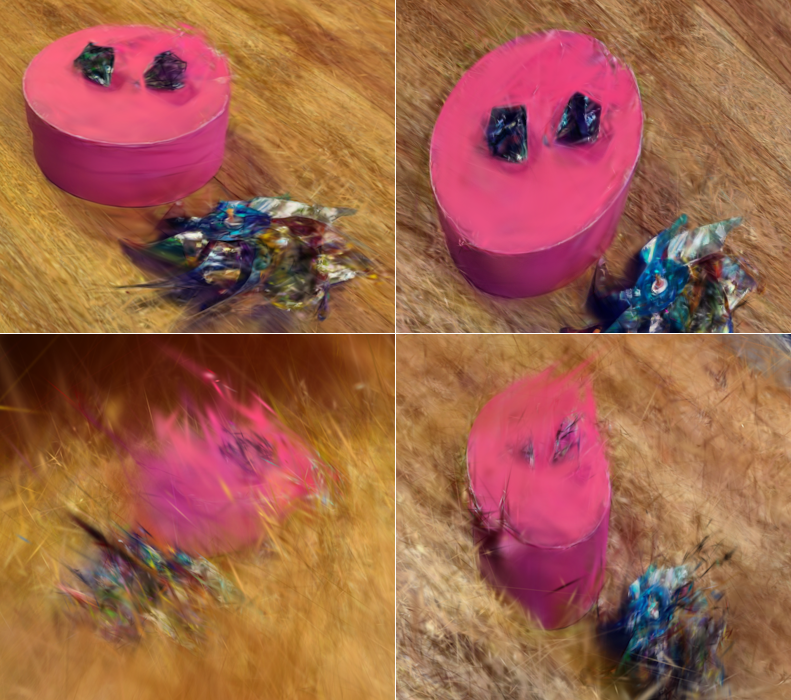{ width = 100% }

### Cutouts 

Another potential avenue for improvement is to focus all processing on the important parts of the scene. We tried processing the diamonds dataset with manually creating cutouts of the diamonds, after generating the camera parameters with Structure from Motion. The parts of the image outside the cutout were either colored black or white. 

The reconstructed models show some interesting features, as shown in \autoref{fig:diamonds_cutouts}. In a way, they resemble a crystal ball with the objects in it, probably because all the cutouts were round. The model with ‘white cutouts’ also created some fascinating patterns around the objects. 

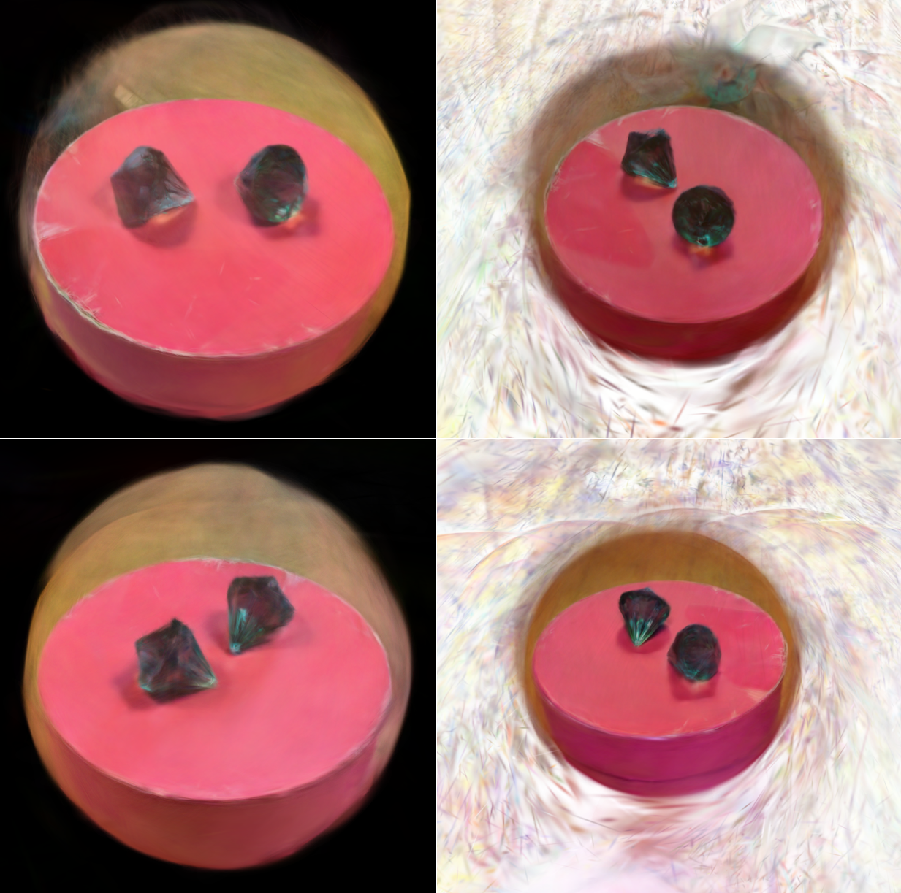{ width = 100% }

### Removing Blurry Images 

Finally, we tried manually removing all extracted frames that were particularly blurry. Out of a total of 288 frames, we kept 172 as input for Gaussian Splatting. Example output is shown in \autoref{fig:diamonds_crisp}. 

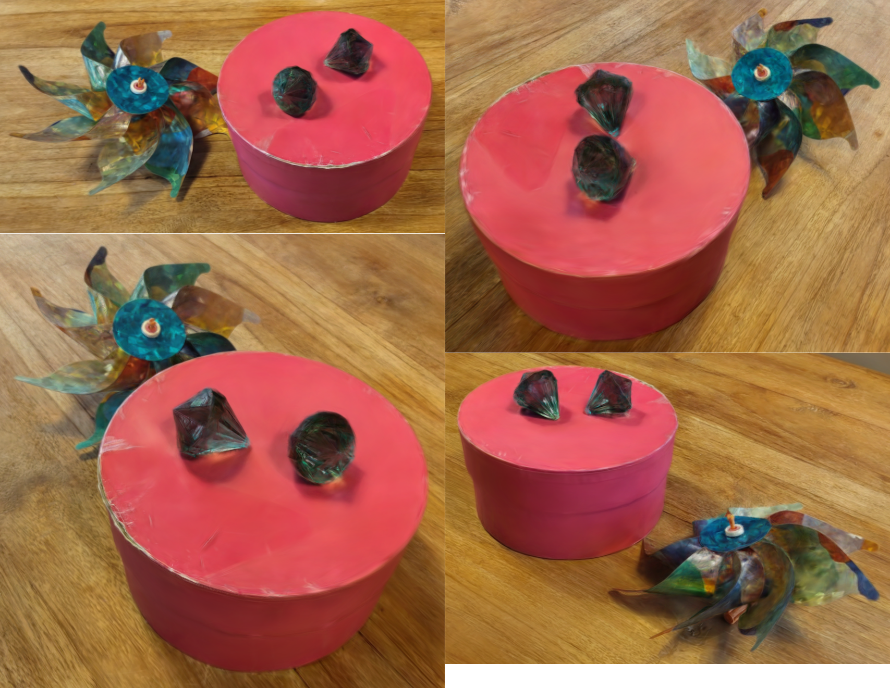{ width = 100% }

The novel views have noticeably better visual quality, as shown in detail in \autoref{fig:diamonds_detail}.

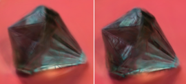{ width = 100% }

However, the reduced dataset still could not faithfully reproduce the extreme specular lighting on the facets of the diamond. For example, we compare an input image of extreme specular reflection to the same viewpoint in the generated 3D Gaussians in \autoref{fig:diamonds_crisp_reflection}. 

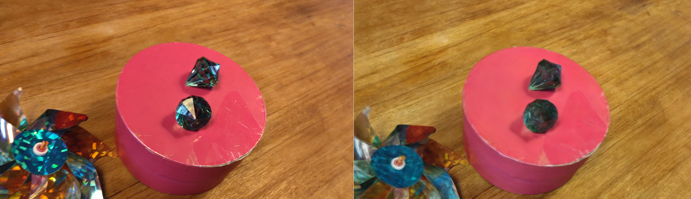{ width = 100% }

# Conclusions

We have implemented a small set of python and batch scripts to simplify running Gaussian Splatting. The resulting pipeline can be controlled using a config file. 

These scripts were tested to try to realistically reconstruct objects with reflective materials. Specifically, a velour pillow and a pair of shiny toy diamonds. These datasets could be processed in a manageable time frame. The reconstructed models gave a realistic impression of the reflective nature of the materials. 

However, particularly the very reflective surfaces of the toy diamonds could not be realistically reconstructed. It seems that Gaussian Splatting will create a mean or median coloring for these surfaces, but it cannot reach the extreme shiny reflections from specific viewpoints. 

# References